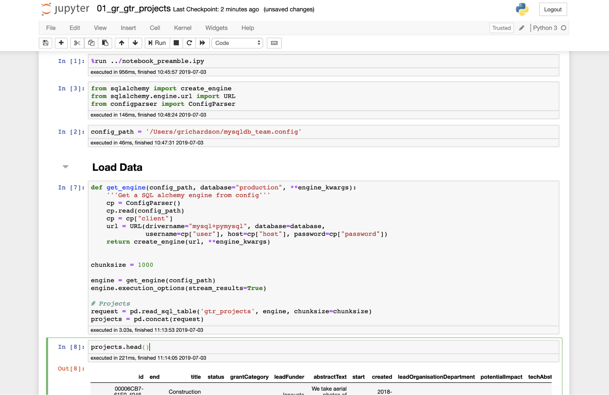
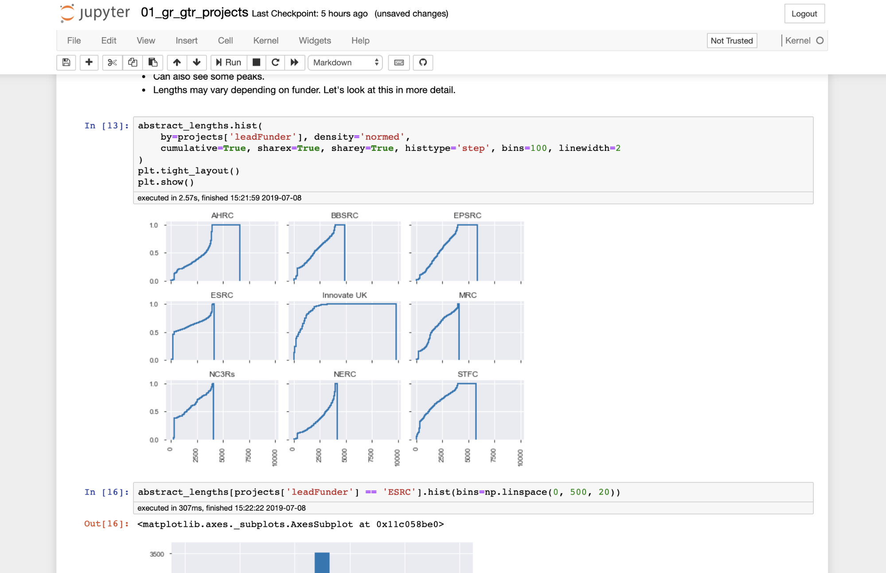
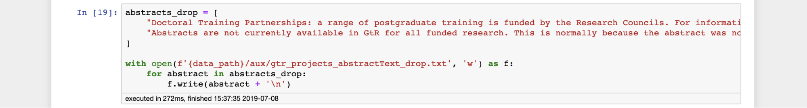
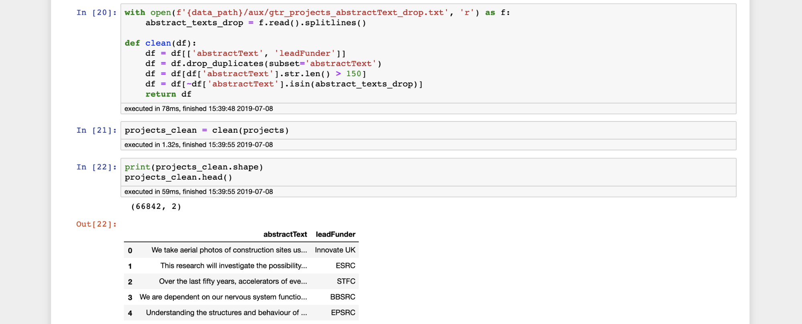
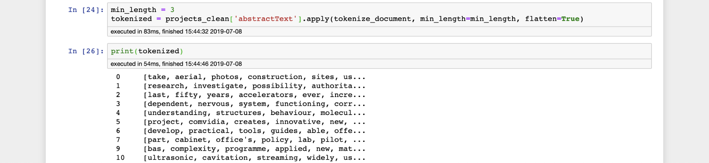
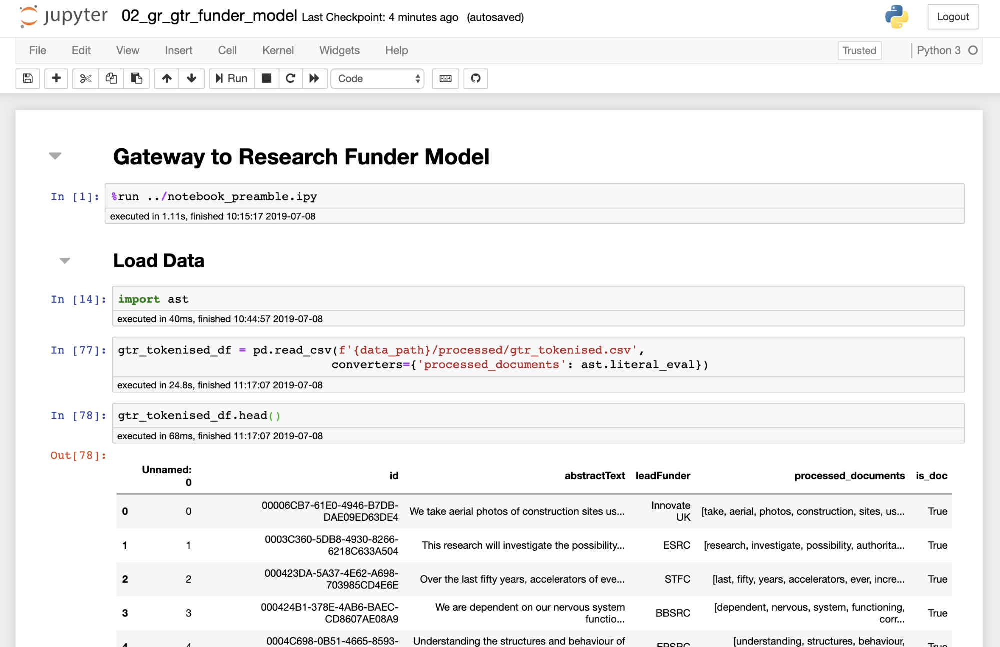
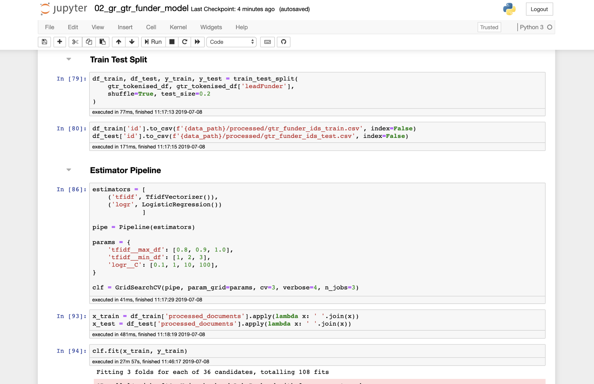

<b>NOTE TO NON-NESTA VISITORS</b>: This tutorial is incomplete 

# Introduction

In this tutorial we are going to cover the workflow for creating a supervised model. In this instance, we will train a classifier to predict the name of the body who funded a research project from Gateway to Research based on its abstract text.

The main aims of this tutorial are to learn how to structure the repository, prototype, and factor out code into modules so that the model and any processed data can be reproduced by anyone else with a simple command.

In this tutorial, we will:

1.  Collect raw data from MySQL
2.  Explore the data in a notebook
3.  Write a data README
4.  Clean and preprocess the data
5.  Factor out cleaning and preprocessing code into modules
6.  Prototype feature extraction and model in a notebook
7.  Train and save the modelling pipeline
8.  Factor out feature extraction and modelling code into modules
9.  Put model and data under version control
10. Update model
<!-- 11. Create a publishable analysis notebook -->

Along the way, we should also keep a lab book, to document what we’ve been doing.

# The Repository

To begin with, clone the repository into a directory on your machine with the `git clone` command:

    $ git clone https://github.com/nestauk/baking-cookies.git
    $ # OR: git clone git@github.com:nestauk/baking-cookies.git

Move in to the repository directory:

    $ cd baking-cookies

If you type `git branch`, you can see that you are on the `master` branch. In general, we want to maintain the master branch for completely finished work, so we will work from the `dev` branch instead (within the settings for a Github repository you can change the default branch from `master` if you wish).

    $ git checkout dev

From `dev` we will create two more branches. One will be for the sub-project - creating our model - and another will be your personal branch for work in progress (WIP).
We make this second one because it is possible that both you and someone else will be prototyping for this sub-project at the same time, and it will be better if you have separate spaces to do this.
For example, this allows you to backup your work by pushing to the remote without worrying about someone else pulling in those changes.
**Do not use someone else's personal branch** : personal branches are liable to be deleted/rebased/make breaking changes.

Use the `-b` flag to create and checkout your new branches simultaneously. I’m going to use my initials ("gr") for the second branch, but you can use your own if you prefer.

    $ git checkout -b gtr-predict-funder
    $ git checkout -b gtr-predict-funder-gr-wip

On your personal branch, you can prototype in notebooks that aren’t intended for mass readership (though you may still want to make them readable enough to show collaborators).
This is where we will work until we’re ready to write more polished code and produce models.

While we’re getting set up, we should install the repository package in to the Python environment you want to use.

    $ pip install -e .

We recommend (disk space permitting) that you have one environment per project. You can initialise a new conda environment by running `make create_environment`, and install the environment requirements in `conda_environment.yaml` with `make requirements`.
When adding requirements to `conda_environment.yaml` only add the major dependencies (e.g. `pandas` not everything it depends on), and do not restrict the version numbers too much (e.g. `- pandas=0.24.2` rather than `- pandas=0.24.2=py37he6710b0_0`) - this will avoid difficulties with other people on different operating systems not being able to reproduce your environment.

# Loading, Cleaning and Preprocessing

You might have noticed that there is a `notebooks` folder in the project root directory.
In here, there is a subdirectory, `dev`. This folder is for any notebooks that can be considered work in progress. See our [guide to using notebooks](https://nestauk.github.io/cookiecutter-data-science-nesta/#notebooks).

Launch jupyter and create a notebook in `notebooks/dev/` for cleaning and processing the data. With our naming convention in mind, we will call this notebook [`01_gr_gtr_projects`](https://github.com/nestauk/baking-cookies/blob/gtr-projects/notebooks/dev/01_gr_gtr_projects.ipynb).

## Loading

The data we need for this tutorial is on Nesta’s MySQL database.
From the screenshot below you can see how we will write some simple code to grab the table we need, but there are also a few important things to note:

1.  The first cell in the notebook magic runs the preamble script. This loads some useful data science libraries and runs some useful boilerplate code so that we can quickly access variables such as the project directory. You can adapt this script to your project’s needs.
2.  We hard code `config_path` to point to the location of our database config file. This is fine for now because we are working in a notebook that no one else is expected to be able to run seamlessly, but we will change it later.
3.  After collecting the data, we show the head of the dataframe. Printing and showing outputs at stages along the prototyping should be standard practice so that if you do show someone else the notebook, they can easily see what’s going on, without needing to run the code.

    

After loading and inspecting the data we will add another cell that saves it locally as a flat file to our `raw` directory.

    projects.to_csv(f'{data_path}/raw/gtr_projects.csv', index=False)

## EDA

All new data should be explored before it is worked with in any serious capacity.
**NOTE**: The EDA in this tutorial is not very rigorous. More rigorous guidelines for EDA are on the [roadmap](https://nestauk.github.io/cookiecutter-data-science-nesta/#roadmap). This section of the tutorial will be updated accordingly in the future.

Here we will use `pandas_profiling` and some more specific exploration. If you don’t have it you can easily install it with

    $ pip install pandas-profiling

The profiler produces a standard output, and covers many data quality elements.
It’s likely to be useful for anyone else looking at this dataset, so we will also save it in the `reports` directory as a html file.

Now we can dive in to the specific features that we’re interested in. First we look at the distribution of funders.

It looks like we have fairly good representation from all of the funders, with over 5,000 projects for each of them apart from NC3Rs.

Let’s also look at the distribution of abstract text lengths.

There’s a peak at around 4,000 characters which presumably relates to a length limitation imposed on submitted abstracts. However, there’s also a peak close to 0. Let’s take a look at the distributions by funder and also have a closer look at that low end.

It looks like there’s some projects with very few characters which we will probably discard. However, there are a high frequency of abstracts with lengths at around 250 and 350 characters. Does this correspond to another word limit, or is there something else happening?

We can print out the highest frequency texts for each funder:

It’s pretty clear that there is some placeholder text that is repeated many times throughout the dataset.

## Cleaning

From all of this information, we can make some decisions about data cleaning:

1.  Drop all projects with abstracts that have fewer than 150 characters
2.  Drop projects where the abstract matches any of the placeholder texts
3.  For good measure, we will also drop all but one of any duplicate abstracts

Step 2 is an example of where we will use the [`aux` data folder](https://nestauk.github.io/cookiecutter-data-science-nesta/#data-folder). This is reserved for small pieces of information that have been manually created and are used in any preprocessing, analysis or modelling. In this case, we will save the two abstracts in a `.txt` file.

Now we can prototype our cleaning function in the notebook and test it on the dataframe.

Looks good.

## Pre-processing

The last step is to prepare our abstracts for modelling by cleaning and tokenizing the raw text.

To do that, copy and paste [this chunk of code](https://gist.github.com/georgerichardson/bbde2b4a5cdde7fedd24d3d157db5ca5) below into a cell and run it.

Finally, we can check that this works by applying it to the text.

Looks good. From here we’re ready to take our first step to factoring out our code into a more reproducible and shareable form.

After exploration and writing cleaning functions, we need to preprocess the text.

## ⏸ Pause - Lab Book

Remember near the beginning, we said we would keep a lab book of what we were doing?
So far we’ve just been forging ahead with coding. That’s great, but before we go too far, we should record what we’ve done.

A lab book is a personal thing and it's up to you how you keep it whether it be paper, google docs, markdown etc.
What is most important is that you keep one. Write down what you tried (even if it failed), references to useful blogs/papers, fixes to bugs/install issues, and issues in the data you discover as you go.
We suggest that you review your lab-book regularly, e.g. daily or weekly, and add information relevant to others as issues/comments on an issue.
One particularly important thing to document in a common issue thread are any outliers/issues/odd entries in a dataset.

## Refactoring

Now at the end of the `make_dataset` stage (before we apply/train any models to generate features).

Here we factor out our functions from our notebooks, write any docstrings necessary, update data Readme's etc.

### [`data/README.md`](https://github.com/nestauk/baking-cookies/blob/gtr-projects/data/README.md)

Write the [data Readme](https://nestauk.github.io/cookiecutter-data-science-nesta/#style-and-documentation).

### [`baking_cookies/data/make_dataset.py`](https://github.com/nestauk/baking-cookies/blob/gtr-projects/baking_cookies/data/make_dataset.py)

- Write a function which collects or reads the raw data
- `.env` file points to config location of the MySQL config file
- Also use `model_config.yaml` which is tracked to get parameters for data processing

### [`baking_cookies/data/sql.py`](https://github.com/nestauk/baking-cookies/blob/gtr-projects/baking_cookies/data/sql.py)

Put our generic `get_engine` function here and add a [`#UTILS` flag](https://nestauk.github.io/cookiecutter-data-science-nesta/#style-and-documentation) to the docstring as this is a reusable component that we don't wish to keep repeating across repositories.

### [`baking_cookies/data/make_gtr.py`](https://github.com/nestauk/baking-cookies/blob/gtr-projects/baking_cookies/data/gtr.py)

- Factor out the data processing functions from the notebook
- Defines file in and file out
- Loads in any `aux` data

### [`baking_cookies/features/text_preprocessing.py`](https://github.com/nestauk/baking-cookies/blob/gtr-projects/baking_cookies/features/text_preprocessing.py)

- Generic functions for text preprocessing that might be applied to other data too
- Add `#UTILS` flag

This is a good point to make a PR. Add someone to review.
In the mean time you can get on with other tasks etc. (put “closes #<issue number>” in commit message)

### **Guidelines**

We have a few guidelines to suggest how you should structure files.
If you find these are not sensible for your use-case please report this on this [issue](https://github.com/nestauk/cookiecutter-data-science-nesta/issues/29).

- Segregate functions into files/folders based on functionality and then dataset where possible.
  You might want to put functionality relating to: data in `baking_cookies/data`; functionality that produces features in `baking_cookies/features`; functionality that produces models in `baking_cookies/models`.
- Each high-level component (e.g. the creation of the cleaned and pre-processed Gateway to Research dataset) should be callable in one function with a prefix `make_` that accepts paths and parameters as arguments.

  - `make_` functions should perform any necessary setup IO work (e.g. read data from disk), call a function with a `process_` prefix, then perform any necessary IO tear-down work (e.g. save data to disk).
  - `process_` functions should accept data and parameters (i.e. not paths) and return data - they should not perform IO!

  It may not always be possible to adhere to this pattern but stick to it where possible.
  (`make_` and `process_` are terrible names which need to be renamed - perhaps `make_` and `run_`? [discuss here](https://github.com/nestauk/baking-cookies/issues/9))

- Parameters should not be hard-coded but specified in `model_config.yaml`, loaded from the dictionary `baking_cookies.config`, and passed into the `make_` prefixed function.

  You could load the config in the `make_` function but consider whether this decreases transparency - less informative doc-strings for `make_` - or generalisability.

- Don't use `print`, use the logging module, e.g. `` logger = logging.getLogger(__name__); logger.info('Logging at info level goes into `info.log`') ``

# Training a model

We now have a cleaned dataset so now we wish to proceed with prototyping a model that predicts the lead Funder from the abstract texts.
The steps we need to follow are:

1.  Make an issue and new branch for model training
2.  Create a [new notebook](https://github.com/nestauk/baking-cookies/blob/gtr-projects/notebooks/dev/02_gr_gtr_funder_model.ipynb)
3.  Load cleaned data

 4. Train test split and save outputs (IDs) 5. Create model pipeline (for training purposes)
 6. Fit and evaluate (at this point you might copy paste evaluation to lab book) 7. Save model
 8. Add notebooks into WIP branch 9. Factor out code and make a PR into `gtr-projects`

The model is very simple, it calculates TF-IDF features for each abstract and performs a logistic regression.
Take a look through the [notebook](https://github.com/nestauk/baking-cookies/blob/gtr-projects/notebooks/dev/02_gr_gtr_funder_model.ipynb) to see the prototyping of the model, and compare this to the factored out code to understand where each of the constituent parts have gone.
We have split up the model pipeline into its constituent parts. This means that changes can be made to one part of the model pipeline (e.g. the train-test split strategy/size) without having to worry about searching through the full pipeline code. This also makes code easier to test. The constituent parts we have chosen are:

- [Train-test split](https://github.com/nestauk/baking-cookies/blob/gtr-projects/baking_cookies/models/train_test_split.py)
- [Training the model](https://github.com/nestauk/baking-cookies/blob/gtr-projects/baking_cookies/models/train_model.py)
- [Evaluating the model](https://github.com/nestauk/baking-cookies/blob/gtr-projects/baking_cookies/models/evaluate.py)

Again we follow the `make_`, `process_` conventions; however in [`train_model.py`](https://github.com/nestauk/baking-cookies/blob/gtr-projects/baking_cookies/models/train_model.py) the model parameters are loaded in `make_train_model()`.

## **Exercise:**

Change this so that the config parameters are loaded in `__main__`, and add an option to pass in whether a `grid_search` is `True` or `False` from the command line using the `click` library (Hint: see [~makedataset.py](https://github.com/nestauk/baking-cookies/blob/dev/baking_cookies/data/make_dataset.py)).

# Publishable notebooks [Incomplete]

- Share interim analyses as Gists
- Save final notebooks as html files and put in `reports/`. These are for presenting results and thus should:
  - Document the purpose of the notebook at the top
  - Provide discussion throughout the document
  - Import and run functions - _not_ define them
  - Ideally be readable and understandable with the code hidden (unless you are demonstrating code usage of course)

# Testing [Incomplete]

# Tools/tips [Incomplete]

## nbextensions + configurator

### Gist-it

### Autopep8

### Hide input

### Select CodeMirror Keymap

### ExecuteTime

## Magics

[Full list here](https://ipython.readthedocs.io/en/stable/interactive/magics.html)

### `%debug`

### `%pdb`

### `%env` / `%set_env`

### `%run`

### `%psearch`

### `%autoreload`

## Profilers

1.  `%prun`
2.  `mprof` - https://pypi.org/project/memory-profiler/
